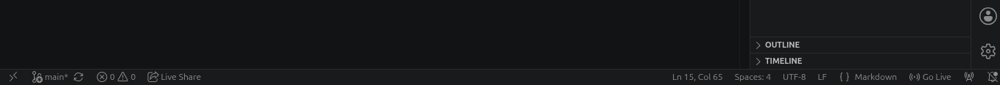
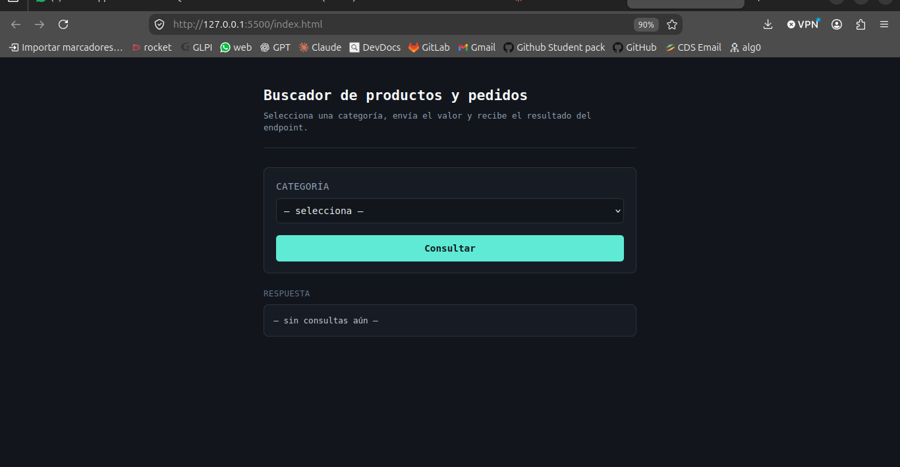

# 360technicalTest
El siguiente repositorio responde a la prueba tecnica otorgada por 360 software SAS que propone la creacion de un modelo embibido que genere dos responses en base a ciertos criterios.

# Paso a paso para la instalacion del proyecto

1. Crear un directorio que aloje el repositorio
2. crear un entorno virtual con el comando "python3 -m venv venv"
3. Activar el entorno virutal con "source venv/bin/activate/" para linux/MacOs o "venv\Scripts\activate" para Windows 
4. Instalar las dependencias del repositorio ubicadas en el requirement.txt con el comando "pip install -r requirement.txt"
5. Una vez instalado las dependencias necesarias, subir el servicio backend con "fastapi dev"

6. Para visualizar el frontend es necesario abrir el codigo con vscode
7. Tener instalada la extension de live server
8. ubicarse en el archivo index.html
9. Activar "Go live" en el panel inferior derecho de la pantalla

!!Listo ya se encuentra completamente funcional el proyecto y se visualiza de la siguiente manera

**NOTA**
es importante saber que para visualizar el frontend debe subir el servicion backend primero , de lo contrario no visualizara nada

# librerias utilizadas para el desarrollo

Para conocer las librerias del proyecto, estas se encuentran ubicadas en requirements.txt
De igual manera los comandos ejecutados para la instalacion de las dependencias fueron los siguientes

1. pip install "fastapi[standar]"
2. pip install pandas
3. pip install openpyxl
4. pip install sklearn

